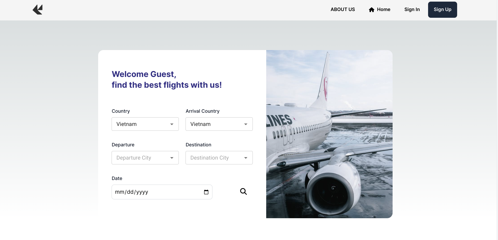
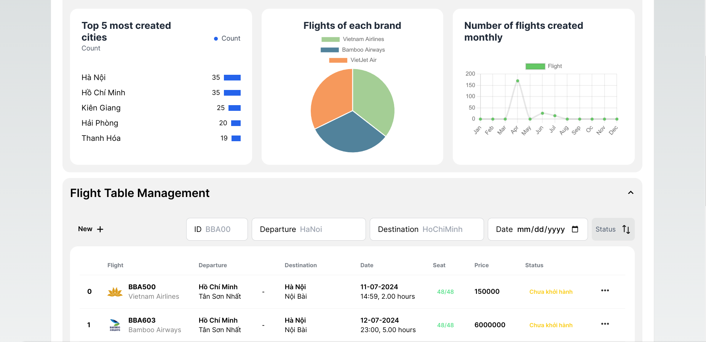
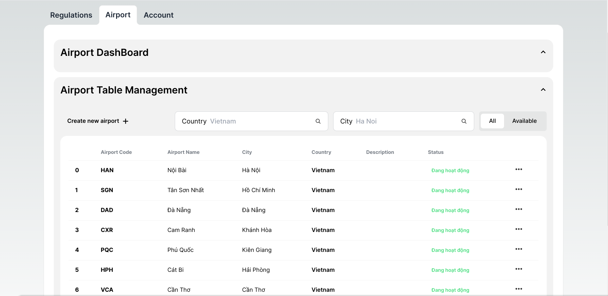
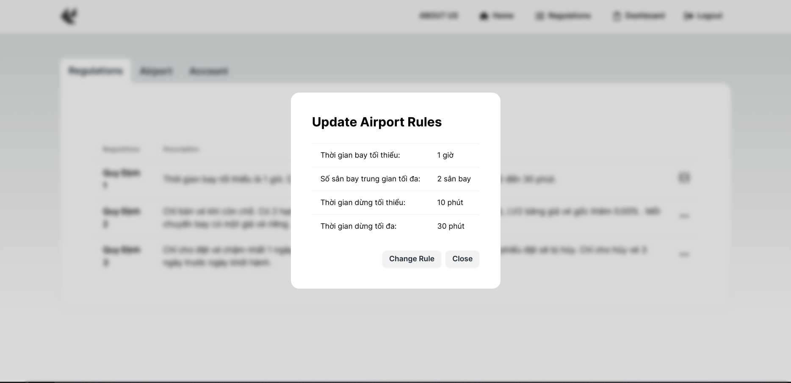
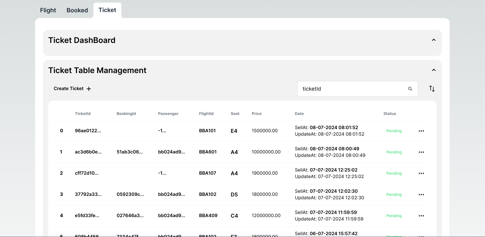
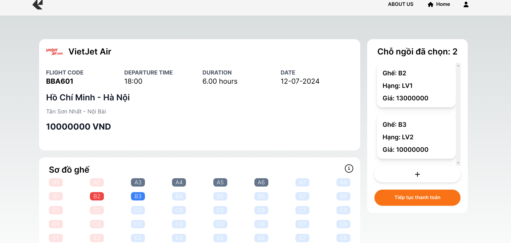
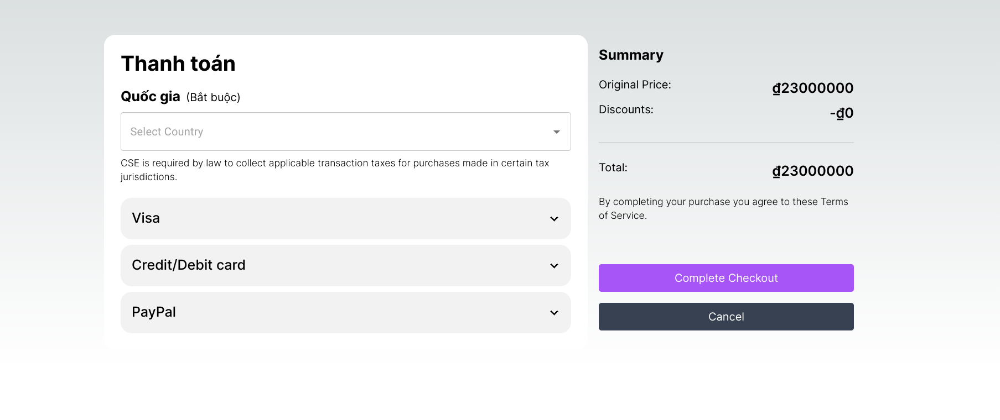
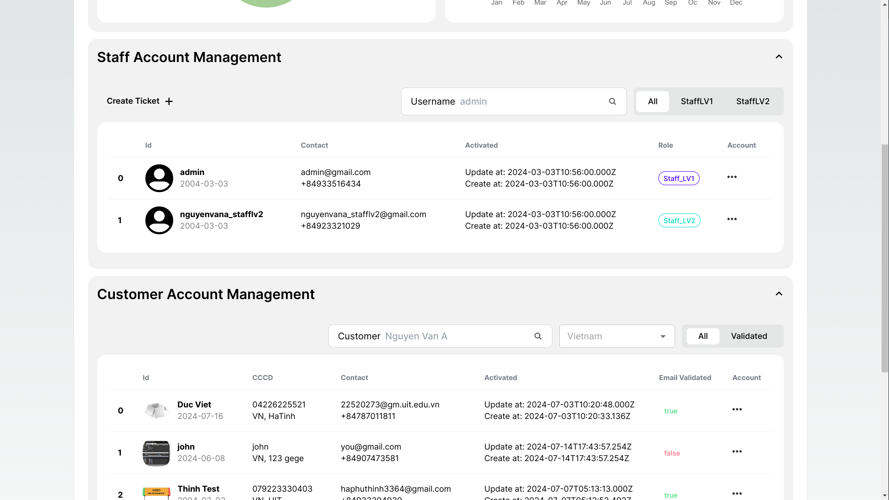

# Airline Management Frontend – SE104 Project

> The rapid growth of the airline tourism industry has significantly increased the need for efficient airline flight management and seamless interaction between airlines and customers.  
> Traditional methods that rely heavily on paperwork and manual processes for managing flights and selling tickets consume substantial human resources and are prone to errors.  
> 
> This project proposes a web-based airline ticket management system that enables both customers and airport staff to view flight information, book, and purchase tickets in a modern, intuitive, and efficient manner—anytime, anywhere, with an internet-connected device.

## Features

### ✈️ Flight Management

- Manage and update flight details, including schedule, destination, airport, aircraft type, and available seats.

### 🛫 Airport Management

- Add and edit airport information such as name and status.

### ⚙️ Regulations Management

- Authorized staff can modify regulations on booking, pricing, flight duration, stopover time, seat classes, etc.

### 🎫 Ticket Management

- Staff can enter customer data, look up flights, and issue printed tickets.

### 🧾 Booking, Reservation, and Payment

  

- Customers can book tickets online using a secure and user-friendly interface.
- Supports multiple payment methods with secure transaction processing.

### 👤 Passenger Information Management

- Store and manage passenger information such as name, phone number, email, and other personal data.

---

## 🗂️ About This Repository

This is the frontend source code of the project, built with the following technologies:

- **Web Framework**: [Next.js](https://nextjs.org/) (based on ReactJS)
- **API Communication**: RESTful API
- **Backend Repository (Express.js)**: [airlane-management.backend](https://github.com/chabuuuu/airlane-management.backend)

---

## 🚀 Live Demo

- Guest Demo: 
- Staff Demo: 

---
